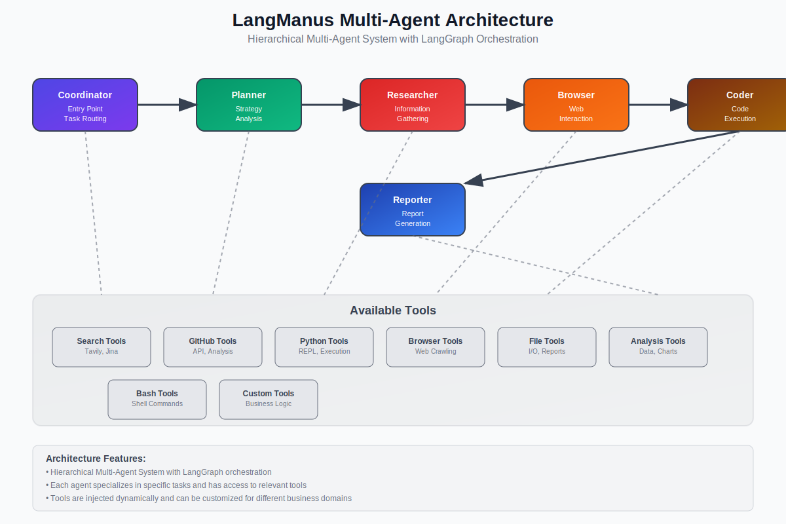

# LangManus Demo - Generic Multi-Agent Framework

[](https://github.com/Darwin-lfl/langmanus)
[](https://github.com/Darwin-lfl/langmanus)
[](https://github.com/Darwin-lfl/langmanus)

A demonstration of the **LangManus framework** with clean architecture design - showcasing how to build a generic multi-agent system that can be adapted to any business domain through dynamic tool injection.


## 🏗️ Architecture Philosophy

This project demonstrates the **correct way** to implement LangManus - as a **generic framework** with business logic separated into tools:

```
┌─────────────────────────────────────┐
│        Generic Framework            │
│  ┌─────────────────────────────┐    │
│  │    Generic Prompts          │    │  ← Business-Agnostic
│  │  • Coordinator              │    │
│  │  • Planner                  │    │
│  │  • Researcher               │    │
│  │  • Browser                  │    │
│  │  • Coder                    │    │
│  │  • Reporter                 │    │
│  └─────────────────────────────┘    │
│                │                    │
│        ┌───────▼──────┐             │
│        │ Tool Injection│             │  ← Dynamic Runtime Injection
│        └───────┬──────┘             │
└────────────────┼──────────────────────┘
                 │
┌────────────────▼──────────────────────┐
│        Business Tools                 │  ← Domain-Specific Logic
│  • GitHub API Tools                   │
│  • Analysis Tools                     │
│  • Custom Business Tools              │
└───────────────────────────────────────┘
```

## ✅ Key Design Principles

1. **Generic Framework**: Core agents use business-agnostic prompts
2. **Tool Injection**: Business logic is provided through tools at runtime
3. **Clean Separation**: Framework and business domains are completely separated
4. **Extensibility**: Easy to add new business domains without changing core code
5. **Reusability**: Same framework works for GitHub, finance, healthcare, etc.

## 🚀 Usage Examples

### Generic Analysis (No Business Tools)
```python
from src.main_app import LangManusAgent

# Generic agent - works with any domain
agent = LangManusAgent(
    task="Analyze the impact of artificial intelligence on society"
)
result = agent.run()
```

### Custom Business Domain (Tool Injection)
```python
# Define your business tools
def analyze_financial_data(data):
    return ["Financial analysis complete"], ["report.pdf"]

def fetch_market_data(symbol):
    return {"symbol": symbol, "price": 100.50}

# Inject tools into generic framework
custom_tools = {
    "analyze_financial_data": analyze_financial_data,
    "fetch_market_data": fetch_market_data
}

agent = LangManusAgent(
    task="Analyze AAPL stock performance",
    tools=custom_tools
)
result = agent.run()
```

### Pre-configured GitHub Analysis
```python
from src.main_app import GitHubAnalysisAgent

# Convenience class with GitHub tools pre-injected
github_agent = GitHubAnalysisAgent()
result = github_agent.run()
```

## 🔧 Architecture Benefits

| Aspect | Traditional Approach | LangManus Approach |
|--------|---------------------|-------------------|
| **Prompts** | Business-specific | Generic & reusable |
| **Extensibility** | Modify core code | Inject new tools |
| **Maintenance** | Change multiple files | Add tools only |
| **Testing** | Test entire system | Test tools separately |
| **Deployment** | Monolithic | Modular components |

## 📋 Core Components

### Generic Framework
- **Prompts**: Business-agnostic agent behaviors
- **Workflow**: Generic multi-agent orchestration
- **State Management**: Universal data containers

### Tool System
- **GitHub Tools**: Repository analysis, trending discovery
- **Analysis Tools**: Data processing, visualization
- **Python Tools**: Code execution, REPL environment, package management
- **File Tools**: File I/O, report generation, content management
- **Browser Tools**: Web scraping, content extraction, metadata parsing
- **Custom Tools**: Your business-specific functionality

### Agent Classes
- **LangManusAgent**: Generic agent with tool injection
- **GitHubAnalysisAgent**: Pre-configured GitHub analysis with comprehensive tools

## 🛠️ Getting Started

### Prerequisites

- Python 3.12+
- Git

### 1. Clone the Repository
```bash
git clone https://github.com/yourusername/LangManus-Demo.git
cd LangManus-Demo
```

### 2. Install Dependencies

#### Option A: Using uv (Recommended)
```bash
# Install uv if you haven't already
curl -LsSf https://astral.sh/uv/install.sh | sh

# Create and activate virtual environment through uv
uv python install 3.12
uv venv --python 3.12

source .venv/bin/activate  # On Windows: .venv\Scripts\activate

# Install dependencies
uv sync
```

#### Option B: Using pip
```bash
# Create virtual environment
python -m venv .venv
source .venv/bin/activate  # On Windows: .venv\Scripts\activate

# Install dependencies
pip install -r requirements.txt

# For development (optional)
pip install -r requirements-dev.txt
```

#### Option C: Using poetry
```bash
# Install poetry if you haven't already
curl -sSL https://install.python-poetry.org | python3 -

# Install dependencies
poetry install
```

#### Option D: Using Makefile (Simplified)
```bash
# For uv users
make install && make setup

# For pip users  
make install-pip && make setup

# For development
make dev  # or make dev-pip
```

### 3. Environment Configuration

1. Copy the environment template:
```bash
cp .env.example .env
```

2. Edit `.env` with your API keys:
```bash
# Required: LLM API
OPENAI_API_KEY=your_openai_api_key_here

# Required: Search API  
TAVILY_API_KEY=your_tavily_api_key_here

# Optional: GitHub API (for GitHub analysis)
GITHUB_TOKEN=your_github_token_here
```

### 4. Run the Application

#### Quick Start (CLI Demo)
```bash
# Architecture demonstration
python demo.py

# Tool testing
python tools_test.py

# Run the project
uv run main.py

```

#### Web Interface
```bash
# Streamlit web app
streamlit run streamlit_app.py

# FastAPI server
python server.py
```

#### Development Mode
```bash
# Run with hot reload
uvicorn server:app --reload --host 0.0.0.0 --port 8000
```

### 5. Docker Deployment (Optional)

#### 使用 Docker Compose（推荐）

```bash
# 1. 配置环境变量
cp .env.example .env
# 编辑 .env 文件，添加您的 API 密钥

# 2. 构建并启动服务
docker compose up -d

# 3. 查看服务状态
docker compose ps

# 4. 查看日志
docker compose logs -f
```

#### 可用的 Docker 服务

- **FastAPI 服务** (端口 8000): `docker compose up langmanus-api`
- **Streamlit Web 界面** (端口 8501): `docker compose up langmanus-web`
- **开发模式** (热重载): `docker compose up langmanus-dev`
- **CLI 演示**: `docker compose run --rm langmanus-cli`
- **离线演示** (无需 API 密钥): `docker compose run --rm langmanus-offline`

#### 传统 Docker 方式

```bash
# 构建镜像
docker build -t langmanus-demo .

# 运行容器
docker run -p 8000:8000 --env-file .env langmanus-demo
```

#### 详细说明

- **多阶段构建**: 优化镜像大小和构建速度
- **健康检查**: 自动监控服务状态
- **数据持久化**: 输出文件挂载到主机
- **安全配置**: 非 root 用户运行

详细部署指南请参考 [DOCKER.md](DOCKER.md)

### 6. Verify Installation

```bash
# Test basic functionality
python -c "
from src.main_app import LangManusAgent
agent = LangManusAgent(task='Test installation')
print('✅ LangManus installation successful!')
"
```

## 📊 Demo Outputs

The demo generates:
- **Architecture diagrams**: Visual framework explanation
- **Tool injection examples**: How to add business logic
- **Generic vs business-specific comparisons**: Clear separation benefits

## 🎯 Why This Approach?

### ❌ **Wrong Way** (Business Logic in Prompts)
```markdown
# Researcher Agent
You are a GitHub repository analyst...
- Find trending Python repositories
- Analyze commit patterns
- Generate GitHub-specific reports
```

### ✅ **Right Way** (Generic Prompts + Tool Injection)
```markdown
# Researcher Agent  
You are a researcher specializing in information gathering...
- Use available tools for research
- Gather data from various sources
- Present findings clearly
```

## 🔄 Migration Guide

If you have business-specific prompts, here's how to migrate:

1. **Extract Business Logic**: Move domain-specific requirements to tools
2. **Generalize Prompts**: Make agent prompts business-agnostic
3. **Create Tool Functions**: Implement business logic as injectable tools
4. **Use Tool Injection**: Pass tools to agents at runtime

## 🔑 API Keys Setup

To use LangManus, you'll need API keys for the following services:

### Required APIs

1. **OpenAI API** (Recommended LLM)
   - Visit: https://platform.openai.com/api-keys
   - Plans: Pay-per-use, starts at $5 credit
   - Models: `gpt-4o-mini` (recommended for cost-efficiency)

2. **Tavily Search API** (Web Search)
   - Visit: https://tavily.com/
   - Free tier: 1,000 searches/month
   - Required for web research functionality

### Optional APIs

3. **GitHub Token** (For GitHub Analysis)
   - Visit: https://github.com/settings/tokens
   - Scope: `public_repo` (for public repos)
   - Free for public repositories

### Alternative LLM Providers

- **Azure OpenAI**: For enterprise users
- **DeepSeek**: Cost-effective alternative
- **Ollama**: For local/offline usage
- **LiteLLM**: Unified interface for multiple providers

## 📖 Quick Start Guide

```bash
# 1. Clone and setup
git clone https://github.com/yourusername/LangManus-Demo.git
cd LangManus-Demo
make install && make setup

# 2. Add your API keys to .env
# Edit .env file with your OpenAI and Tavily API keys

# 3. Test the installation
python demo.py

# 4. Run web interface
make streamlit
```

## 🎯 Common Use Cases

### Research & Analysis
- Market research with web scraping
- Academic paper analysis
- Competitive intelligence
- Data gathering and synthesis

### Code & Development
- Code review and analysis
- Documentation generation
- Architecture analysis
- Technical debt assessment

### Content & Reporting
- Automated report generation
- Content research and writing
- Data visualization
- Executive summaries

## 🤝 Contributing

We welcome contributions that maintain the clean architecture:

1. **Add New Tools**: Create business-specific tools in `src/tools/`
2. **Keep Prompts Generic**: Don't add business logic to `src/prompts/`
3. **Test Separately**: Tools and framework should be independently testable
4. **Document Patterns**: Show how new domains can use the framework

See [CONTRIBUTING.md](CONTRIBUTING.md) for detailed guidelines.

## 📚 Learn More

- **Original LangManus**: [GitHub Repository](https://github.com/Darwin-lfl/langmanus)
- **Framework Tutorial**: [DataCamp Tutorial](https://www.datacamp.com/tutorial/langmanus)
- **Architecture Guide**: See `demo.py` for complete examples
- **Documentation**: [Official Docs](https://github.com/Darwin-lfl/langmanus/blob/main/README.md)

## 📄 License

This project is licensed under the MIT License - see the [LICENSE](LICENSE) file for details.

## ⭐ Support

If you find this project helpful, please give it a star! ⭐

For questions and support:
- 📝 [Create an Issue](https://github.com/yourusername/LangManus-Demo/issues)
- 💬 [GitHub Discussions](https://github.com/Darwin-lfl/langmanus/discussions)
- 📧 Email: demo@example.com

---

**Built with ❤️ using the LangManus framework - demonstrating clean architecture for AI systems**

LangManus implements a hierarchical multi-agent system where a supervisor coordinates specialized agents to accomplish complex tasks:



The system consists of the following agents working together:

1. **Coordinator** - The entry point that handles initial interactions and routes tasks
2. **Planner** - Analyzes tasks and creates execution strategies
3. **Supervisor** - Oversees and manages the execution of other agents
4. **Researcher** - Gathers and analyzes information
5. **Coder** - Handles code generation and modifications
6. **Browser** - Performs web browsing and information retrieval
7. **Reporter** - Generates reports and summaries of the workflow results

